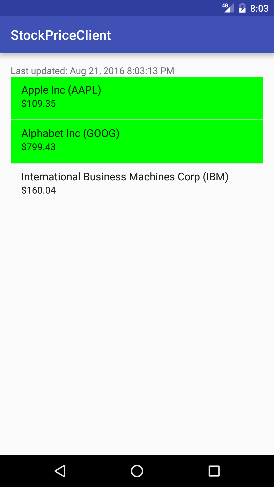

#  Sync Adapters Lab

## Introduction

> ***Note:*** _This should be done in pairs._

In this lab, you will be setting up a sync adapter to get the latest stock prices for the companies in your stock portfolio (the Content Provier lab) using the [MarkIt On Demand API](http://dev.markitondemand.com/MODApis/). The prices should update every minute.

In addition, stocks that are on the NASDAQ should be shown differently than the other stocks (ie making the background green).

## Exercise

#### Requirements

- Display stock prices from your portfolio app
- Update the stock price every minute using a Sync adapter
- Store the prices after each update in a local database
- Display the NASDAQ stocks in a unique manner
- Display the last updated time on the screen

**Bonus:**
- Allow the user to set the sync period
- Allow the user to choose which stock exchange shows up differently (NASDAQ must be an option)

#### Starter code

Solution code from the Content-Providers lab has been given to you. You are welcome to use your own solution code if you want to.

#### Deliverable

An app that meets the above requirements.

